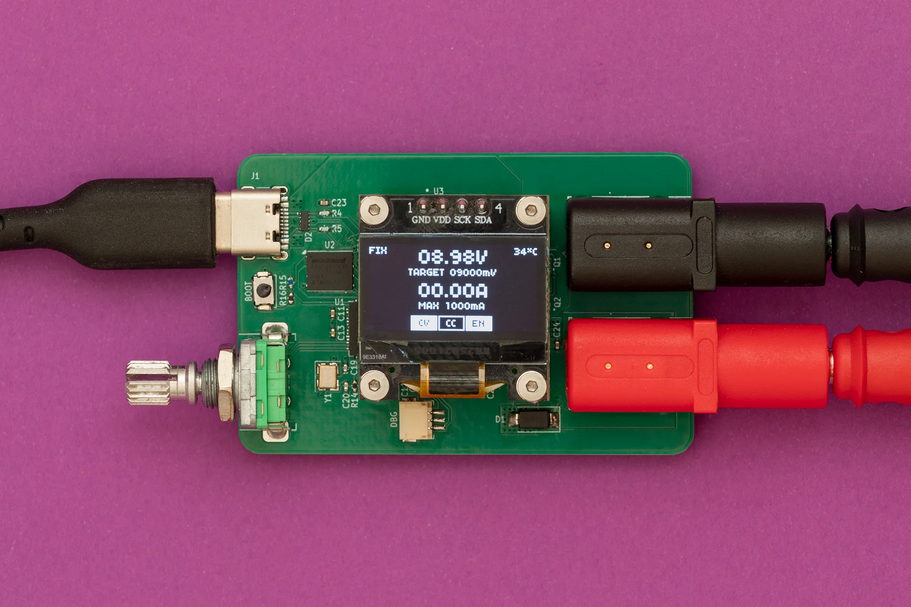

## Description

TinyPPS is a pocket-sized programmable power supply built on the USB Power Delivery (PD) standard and the USB Programmable Power Supply (PPS) feature. It transforms a standard USB-C PD charger into a flexible bench-style power source by negotiating selectable output voltages and current limits directly with the charger.

Key features:
- Support for fixed PDO and PPS profiles
- Operating VCC voltage range: 3 V to 31 V
- Fine-grained voltage adjustment via PPS negotiation (100mV steps)
- Output current up to 5 A *(charger and cable dependent)*
- Programmable current limiting (250mA steps)
- User-switchable output

Huge thank you to **[PCBWay](https://www.pcbway.com)** for sponsoring this project!

## Firmware

The firmware is written in C++ using the Raspberry Pi Pico SDK.

## Flashing

There are two options to flash RP2040:
1. Via USB by pressing the `BOOT` button during power on. On a PC a new virtual drive called `RPI-RP2` should appear. Then, drag and drop a *.uf2* file onto the drive.
2. Via SWD interface by attaching a debugger like Raspberry Pi Debug Probe to the "DBG" connector and then using OpenOCD.

## Hardware

Schematic and PCB are designed in KiCAD.

Key components:

- The schematic is based on the **RP2040** and **AP33772S** reference designs.
- A **0.96 in 128×64 SSD1306 OLED** is added to display the UI.
- A **EC11** rotary encoder is added for user input.
- **INA226** is used for measuring current and voltage. *While AP33772s provides these features, INA226 gives more precise measurements.*

## Resources

1. [Hardware design with RP2040](https://pip-assets.raspberrypi.com/categories/814-rp2040/documents/RP-008279-DS-1-hardware-design-with-rp2040.pdf?disposition=inline)
2. [AP33772S I2C USB PD Sink Controller EVB User Guide](https://www.diodes.com/assets/Evaluation-Boards/AP33772S-Sink-Controller-EVB-User-Guide.pdf)
3. [SSD1306](https://cdn-shop.adafruit.com/datasheets/SSD1306.pdf)
4. [INA226](https://www.ti.com/lit/ds/symlink/ina226.pdf?ts=1770072845830)
5. [RobTillaart/INA226](https://github.com/RobTillaart/INA226)