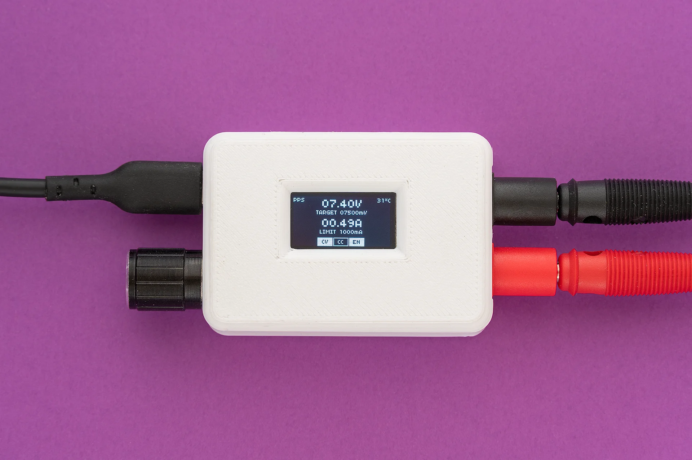
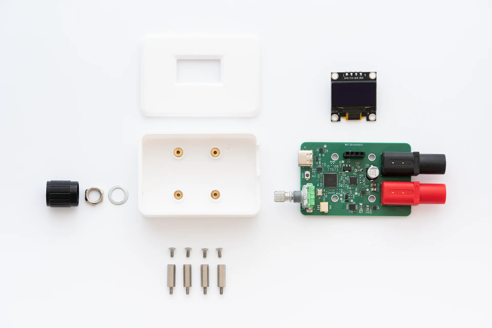
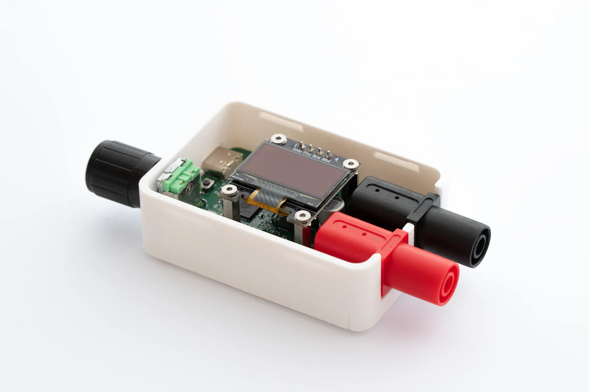

## Description

TinyPPS is a pocket-sized programmable power supply built on the USB Power Delivery (PD) standard and the USB Programmable Power Supply (PPS) feature. It transforms a standard USB-C PD charger into a flexible bench-style power source by negotiating selectable output voltages and current limits directly with the charger.



## Key features

TinyPPS takes advantage of pin-compatible USB PD sink ICs (AP33772 and AP33772S), providing two feature sets within a single firmware, depending on the selected IC:

| Feature | With AP33772s | With AP33772 |
| - | - | - |
| Supported PDO profiles | fixed PDO, PPS | fixed PDO, PPS |
| Output voltage range | 3.3 - 21V | 3.3 - 21V |
| Max output current* | 5A | 5A |
| PPS voltage step size | 100mV/Step | 20mV/Step |
| Programmable current limit | 250mA/Step | 50mA/Step |
| User-switchable output | ✅ | ✅ |
| Over Voltage Protection (OVP) | ✅ → Hard Reset and Auto Restart | ✅ → Auto Restart |
| Over Current Protection (OCP) | ✅ → Output Disable | ✅ → Auto Restart |
| Under Voltage Protection (UVP) | ✅ → Output Disable | ❌ |
| Over temperature protection (OTP)** | ✅ → Output Disable | ✅ → Output Disable |
| Short-Circuit Protection (SCP) | ✅ → Output Disable | ✅ → Output Disable |

**charger and cable dependent*

***OTP is set to 85°C*

Huge thank you to **[PCBWay](https://www.pcbway.com)** for sponsoring this project!


## Firmware

The firmware is written in C++ using the Raspberry Pi Pico SDK. No external dependencies are used.

Configuring the build using CMake:

```bash
cd firmware
cmake -G Ninja -S . -B build
```

Building the firmware:

```bash
cmake --build build
```

## Flashing

There are two options to flash RP2040:
1. Via USB by pressing the `BOOT` button during power on. On a PC a new virtual drive called `RPI-RP2` should appear. Then, drag and drop a *.uf2* file onto the drive.
2. Via SWD interface by attaching a debugger like Raspberry Pi Debug Probe to the "DBG" connector and then using OpenOCD.
    ```bash
    cmake --build build --target flash
    ```

## Hardware

Schematic and PCB are designed in KiCAD 10.

Key components:

- The device is based on the **RP2040** microcontroller and **AP33772(S)** USB PD sink controller.
- A **0.96 in 128×64 SSD1306 OLED** is added to display the UI.
- A **EC11** rotary encoder is added for user input.
- **INA226** is used for measuring current and voltage. *While AP33772s provides these features, INA226 gives more precise measurements.*
- **LM73100** replaces the back-to-back NMOS switch and provides short circuit protection.
- **74LVC1G08GW,125** single 2-input AND gate is used for output enable.

## Case

3D model is made with Autodesk Fusion 360.

The case is 3D printed with ABS so it can handle higher tempeatures.





## Resources

1. [Hardware design with RP2040](https://pip-assets.raspberrypi.com/categories/814-rp2040/documents/RP-008279-DS-1-hardware-design-with-rp2040.pdf?disposition=inline)
2. [AP33772S I2C USB PD Sink Controller EVB User Guide](https://www.diodes.com/assets/Evaluation-Boards/AP33772S-Sink-Controller-EVB-User-Guide.pdf)
3. [SSD1306](https://cdn-shop.adafruit.com/datasheets/SSD1306.pdf)
4. [INA226](https://www.ti.com/lit/ds/symlink/ina226.pdf?ts=1770072845830)
